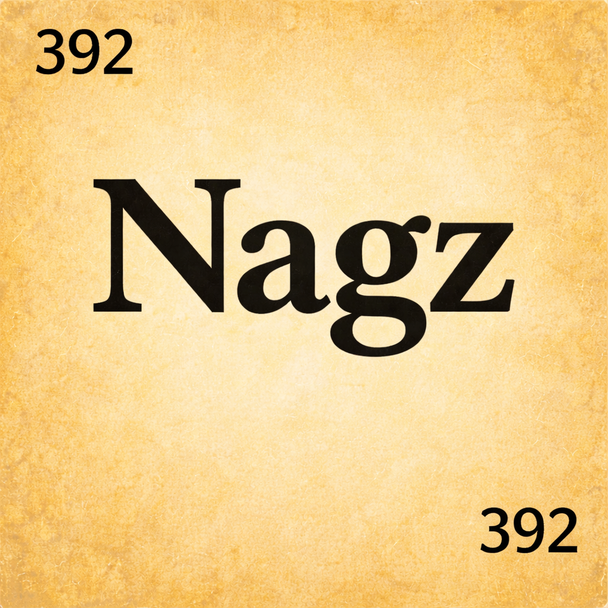

<p align="center">
  
</p>

# Nagz iOS

SwiftUI iOS client for **Nagz**, a family-oriented AI-mediated nagging/reminder app with Apple Intelligence integration.

## Stack

- SwiftUI + MVVM, iOS 26+
- Swift 6 strict concurrency
- Xcode project generated with [XcodeGen](https://github.com/yonaskolb/XcodeGen) from `project.yml`
- Dependencies: [KeychainAccess](https://github.com/kishikawakatsumi/KeychainAccess), [GRDB](https://github.com/groue/GRDB.swift) (SPM)

## AI Features

Nagz uses a **split AI architecture** — on-device intelligence for privacy-sensitive features and server-side AI for coordination and cross-user analysis.

| Feature | On-Device (iOS) | Server Fallback |
|---------|-----------------|-----------------|
| Excuse summarization | Apple Foundation Models (iOS 26+) | Heuristic engine |
| Tone selection | Local event cache (GRDB) | `/ai/select-tone` |
| Coaching tips | Local heuristics | `/ai/coaching` |
| Behavioral patterns | GRDB event analysis | `/ai/patterns` |
| Completion prediction | Local stats | `/ai/predict-completion` |
| Push-back evaluation | Local policy check | `/ai/push-back` |
| Weekly digest | — | `/ai/digest` (server-only) |

On-device AI processes excuse text and behavioral patterns locally — only structured data (categories, status) is shared with the server. See [AI_ARCHITECTURE.md](https://github.com/billdonner/nagz/blob/main/nagz/Docs/AI_ARCHITECTURE.md) for the full design.

### Siri & Shortcuts (Implemented)

App Intents integration for voice and automation:
- "Show my nags in Nagz" / "What's overdue in Nagz"
- "Create a homework nag for John in Nagz"
- "Mark my nag as done in Nagz"
- Shortcuts automations (morning check, location triggers, end-of-day reports)

See [SIRI_SHORTCUTS.md](https://github.com/billdonner/nagz/blob/main/nagz/Docs/SIRI_SHORTCUTS.md) for the full spec.

## Architecture

| Layer | Key files |
|-------|-----------|
| Models | `Nagz/Models/` — Codable structs for nags, families, auth, gamification, etc. |
| Views | `Nagz/Views/` — SwiftUI views organized by feature (Auth, Nags, Family, Guardian, Safety, Gamification) |
| ViewModels | `Nagz/ViewModels/` — `@Observable` view models |
| Services | `Nagz/Services/` — `APIClient` (actor), `AuthManager`, `KeychainService`, `PushNotificationService`, `VersionChecker` |
| AI | `Nagz/Services/AI/` — `AIService` protocol, `OnDeviceAIService`, `ServerAIService` |
| Local Cache | `Nagz/Database/` — GRDB event cache for offline AI + sync |
| Navigation | `Nagz/Navigation/` — `ContentView`, `AuthenticatedTabView` |

## Getting Started

```bash
# Generate the Xcode project
cd ~/nagz-ios && xcodegen generate

# Open in Xcode
open Nagz.xcodeproj
```

Build and run on an iOS 26+ simulator or device.

The dev server is expected at `http://127.0.0.1:9800/api/v1` (use IP, not `localhost`, to avoid IPv6 timeout in the simulator).

## Tests (215)

```bash
xcodebuild test -project Nagz.xcodeproj -scheme Nagz \
  -destination 'platform=iOS Simulator,name=iPhone 16 Pro Max,OS=18.5'
```

## Related Repos

| Repo | Description |
|------|-------------|
| [nagzerver](https://github.com/billdonner/nagzerver) | Python API server (source of truth) |
| [nagz-web](https://github.com/billdonner/nagz-web) | React/TypeScript web client |
| [nagz](https://github.com/billdonner/nagz) | Specs and documentation |
